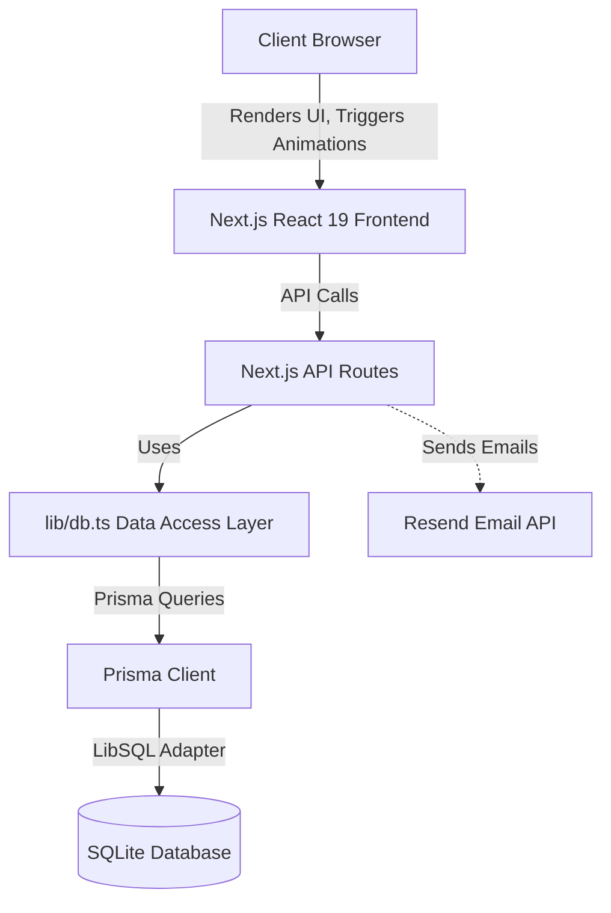
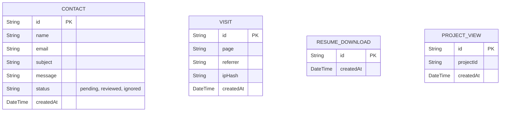

# SGK18 Portfolio

## 1. Project Overview

**Project Name:** SGK18 Portfolio
**Description:** A highly polished, visually stunning personal portfolio showcasing projects, experience, and skills using cutting-edge web technologies like Next.js 16, React 19, Three.js, and GSAP. It features a custom-built analytics engine, a protected admin dashboard, and a seamless contact system.
**Problem Statement:** Developers often rely on generic templates or third-party analytics (like Google Analytics) that compromise user privacy and look identical to others. This project solves the need for a highly personalized, performant, and privacy-respecting portfolio with its own integrated management system.
**Business Objective:** To serve as a high-impact digital resume and lead-generation tool that captures recruiter and client interest, while tracking engagement through a proprietary backend system without relying on invasive third-party cookies.
**Target Users:** Recruiters, hiring managers, potential clients, and other developers interested in modern web architecture.
**Key Features:**
- Interactive 3D WebGL backgrounds (`Hyperspeed.tsx`)
- Smooth scrolling and complex scroll-triggered animations (Lenis & GSAP)
- Custom-built page view, project view, and resume download tracking
- Secure Admin Dashboard for reviewing messages and analytics
- Email integration with Resend
- Honeypot and rate-limiting security on forms

---

## 2. Architecture Overview

### High-Level Architecture
The application is built on the Next.js App Router paradigm. It uses React Server Components where possible for performance, and Client Components for interactive 3D and GSAP animations. The backend uses Next.js Route Handlers (API routes) connected to an SQLite database via Prisma and the LibSQL adapter.

### System Flow
1. **User visits site:** Analytics API is pinged in the background to record the visit.
2. **User interacts:** Interactions (e.g., viewing a project, downloading a resume) trigger specific tracking API calls.
3. **User submits contact form:** Data is validated, rate-limited, checked against a honeypot, saved to the database, and an email is dispatched via Resend.
4. **Admin logs in:** The admin accesses `/admin`, authenticates via header-based password matching, and fetches aggregated database records.

### Data Flow Diagram



---

## 3. Technology Stack

### Frontend
| Technology | Purpose | Why it is used | Location |
|---|---|---|---|
| **Next.js 16** | Meta-framework | App Router, SSR, Server Components | Core |
| **React 19** | UI Library | Latest hooks and concurrent features | `app/`, `components/` |
| **Three.js** | 3D Graphics | Renders the immersive background | `components/Hyperspeed.tsx` |

### Backend
| Technology | Purpose | Why it is used | Location |
|---|---|---|---|
| **Next.js Route Handlers** | API Layer | Serverless backend execution | `app/api/` |
| **Node.js** | Runtime | Backend logic execution | Server |

### Database
| Technology | Purpose | Why it is used | Location |
|---|---|---|---|
| **SQLite (dev.db)** | Relational DB | Lightweight, zero-config local development | `prisma/dev.db` |
| **Prisma 7.8** | ORM | Type-safe database queries | `lib/prisma.ts` |
| **LibSQL Adapter** | DB Driver | Allows transitioning to Turso edge databases | `lib/prisma.ts` |

### Styling & UI Libraries
| Technology | Purpose | Why it is used | Location |
|---|---|---|---|
| **Tailwind CSS 4** | Styling | Utility-first, fast prototyping | `app/globals.css` |
| **GSAP & Framer Motion** | Animation | Industry standard for complex timeline animations | `components/` |
| **Lucide React / React Icons** | Iconography | Lightweight, customizable SVG icons | `components/` |
| **Lenis** | Smooth Scrolling | Overrides native scroll for cinematic feel | `components/LenisProvider.tsx` |

### Third-Party Services
| Technology | Purpose | Why it is used | Location |
|---|---|---|---|
| **Resend** | Email Delivery | Reliable transactional emails for the contact form | `app/api/contact/route.ts` |

---

## 4. Project Structure

```
C:\projects\SGK18_Portfolio\
├── app/                  # Next.js App Router (Pages & APIs)
│   ├── admin/            # Admin dashboard UI
│   ├── api/              # Backend API Route Handlers
│   ├── globals.css       # Global Tailwind v4 styles
│   ├── layout.tsx        # Root layout, fonts, and metadata
│   └── page.tsx          # Main landing page
├── components/           # Reusable React UI Components
│   ├── About.tsx         # About section
│   ├── Contact.tsx       # Contact form component
│   ├── Hero.tsx          # Hero section with 3D background
│   ├── Hyperspeed.tsx    # Three.js 3D effect component
│   ├── LenisProvider.tsx # Smooth scrolling wrapper
│   └── ...               # Other UI sections
├── data/                 # Static data
│   └── caseStudies.ts    # JSON/TS data for projects
├── lib/                  # Utilities & Services
│   ├── db.ts             # Database access service layer
│   ├── prisma.ts         # Prisma client instantiation
│   └── smoothScroll.ts   # Scroll utility helpers
├── prisma/               # Database Configuration
│   ├── schema.prisma     # Database schema definition
│   └── dev.db            # Local SQLite database
└── public/               # Static assets (images, PDFs)
```

---

## 5. File-by-File Documentation

### `lib/db.ts`
- **Purpose:** Acts as the primary Data Access Layer (DAL) separating database logic from API routes.
- **Responsibilities:** Executes typed queries for Contacts, Visits, Downloads, and Project Views. Aggregates data for the admin dashboard.
- **Used By:** `app/api/**/*.ts`
- **Important Notes:** Contains the `getAnalyticsSummary` function which performs in-memory grouping of referrers and page views to minimize complex SQL queries.

### `lib/prisma.ts`
- **Purpose:** Instantiates a singleton instance of the Prisma Client.
- **Responsibilities:** Connects Prisma to the LibSQL adapter pointing to the local `dev.db`. Prevents multiple instances during hot-reloads in development.
- **Dependencies:** `@prisma/client`, `@prisma/adapter-libsql`.

### `app/api/contact/route.ts`
- **Purpose:** Handles contact form submissions.
- **Responsibilities:** Validates input, checks the honeypot field, enforces IP-based rate limiting, saves the submission to the DB, and dispatches an email via Resend.
- **Security:** In-memory rate limiting map (resets on server restart).

### `components/Hyperspeed.tsx`
- **Purpose:** Renders the 3D hyperspeed background effect.
- **Dependencies:** `three.js`.
- **Important Notes:** Heavily relies on browser APIs (WebGL). Must be rendered client-side only.

---

## 6. Installation Guide

### Prerequisites
- Node.js (v20+ recommended)
- npm (v10+)

### Local Setup
1. Clone the repository:
   ```bash
   git clone https://github.com/sgk18/SGK18_Portfolio.git
   cd SGK18_Portfolio
   ```

2. Install dependencies:
   ```bash
   npm install
   ```

3. Environment Setup:
   Create a `.env.local` file in the root directory:
   ```env
   ADMIN_PASSWORD=your_secure_password_here
   RESEND_API_KEY=re_your_resend_api_key
   ```

4. Database Setup:
   Initialize the SQLite database with Prisma:
   ```bash
   npx prisma generate
   npx prisma db push
   ```

5. Run Development Server:
   ```bash
   npm run dev
   ```

---

## 7. Environment Variables

| Variable | Required | Description | Example |
| -------- | -------- | ----------- | ------- |
| `ADMIN_PASSWORD` | Yes | Password used to authenticate the `/admin` route. | `supersecret123` |
| `RESEND_API_KEY` | No | API key for sending emails via Resend. Contact API will skip emails if not present. | `re_123456789` |

*(Note: `DATABASE_URL` is omitted as the codebase hardcodes the connection to `file:dev.db` via `process.cwd()` in `lib/prisma.ts`.)*

---

## 8. Database Documentation

### Database Architecture
The application uses SQLite powered by the LibSQL adapter. It tracks user interactions (Visits, Downloads, Project Views) and stores Contact Form submissions.

### Entity Relationship Diagram



---

## 9. API Documentation

### `POST /api/contact`
- **Method:** POST
- **Purpose:** Submit a contact form message.
- **Request Body:** `{ "name": "John", "email": "john@ex.com", "subject": "Hi", "message": "...", "hp_field": "" }`
- **Response:** `200 OK { "success": true }`
- **Error Responses:** `400 Bad Request`, `429 Too Many Requests`.

### `GET /api/admin/analytics`
- **Method:** GET
- **Purpose:** Retrieve aggregated analytics for the admin dashboard.
- **Authentication:** Requires `x-admin-password` header matching `ADMIN_PASSWORD` env var.
- **Response:** JSON object containing `totalVisitors`, `pageViews`, `recentVisits`, etc.

### `PATCH /api/admin/contacts`
- **Method:** PATCH
- **Purpose:** Update the status of a contact submission (`pending` -> `reviewed`).
- **Request Body:** `{ "id": "cuid...", "status": "reviewed" }`

---

## 10. Authentication & Authorization

The project utilizes a lightweight, header-based authentication strategy tailored for a single-user portfolio dashboard.
- **Login Flow:** The user enters a password on `/admin`. The client sends a request to `/api/admin/analytics` with the `x-admin-password` header. If it returns 200, the client sets an `authed` state to true.
- **Route Protection:** Every request to `/api/admin/*` checks the header against `process.env.ADMIN_PASSWORD`.
- **Security:** There are no sessions or JWTs. The password is kept in React state and passed with every admin API request.

---

## 11. Core Modules

### Analytics Module
- **Purpose:** Silently track user behavior.
- **Workflow:** When a user lands on the page, a `useEffect` hook in a client component triggers `POST /api/analytics/visit`. The IP address is hashed using SHA-256 before storage to preserve anonymity.
- **Business Logic:** Referrers are parsed down to hostnames. Unique visitors are calculated based on distinct IP hashes.

### Contact Module
- **Purpose:** Handle incoming messages.
- **Workflow:** Form UI -> Validation -> API -> Rate Limit Check -> Honeypot Check -> DB Save -> Resend Email.

---

## 12. Frontend Documentation

- **Routing:** Handled entirely by Next.js 16 App Router.
- **Component Hierarchy:** `page.tsx` renders modular sections (`Hero`, `About`, `Experience`, `Projects`, `Contact`).
- **Animations:** Employs a dual approach:
  - **GSAP:** Used for complex timeline animations and scroll-triggered element reveals (`@gsap/react`).
  - **Framer Motion & Three.js:** Used for micro-interactions and the 3D hyperspeed canvas.
- **Responsive Design:** Utilizes Tailwind v4 utilities (`sm:`, `md:`, `lg:`) to adjust grid layouts and font sizes across devices.

---

## 13. Backend Documentation

- **Services:** `lib/db.ts` isolates all Prisma queries. This ensures that API controllers only handle HTTP requests and validation, adhering to separation of concerns.
- **Middleware:** No Next.js middleware is currently utilized; authentication and rate-limiting are handled directly within the route handlers.
- **Error Handling:** Try-catch blocks wrap database and Resend operations, returning clean JSON 500 errors to the client to prevent application crashes.

---

## 14. Development Workflow

- **Code Style:** Enforced via standard ESLint and TypeScript compilation checks.
- **Typing:** Strict TypeScript interfaces (defined in `lib/db.ts` and `app/admin/page.tsx`).
- **Build Process:** Uses Turbopack for rapid local development and standard Webpack for production builds (`npm run build`).

---

## 15. Testing

Currently, no automated testing frameworks (Jest/Playwright/Cypress) are configured. 
- **Manual Testing:** Recommended to verify the 3D canvas on multiple browsers (Safari, Chrome, Firefox) due to WebGL constraints.
- **Build Checks:** Next.js `build` script acts as the primary type-checker and linter prior to deployment.

---

## 16. CI/CD Pipeline

- **Vercel Integration:** Configured via `vercel.json`.
- **Deployment Flow:** Pushes to the `main` branch on GitHub automatically trigger a Vercel build and deployment.
- **Build Process:** Vercel runs `npm install`, then `npm run build`. The `.next` output directory is cached and deployed to Vercel's Edge Network.

---

## 17. Security Considerations

- **Rate Limiting:** IP-based rate limiting on the `/api/contact` route prevents email spam (max 3 requests per minute).
- **Honeypot:** A hidden field (`hp_field`) traps automated bots that blindly fill out all form inputs.
- **Data Protection:** Visitor IPs are hashed with SHA-256 before being stored in the database. Raw IPs are never persisted.
- **Secrets Management:** Passwords and API keys are strictly kept in `.env.local` and never exposed to the client bundle.

---

## 18. Performance Optimizations

- **Next.js Features:** Utilizes native Next.js `<Image>` components for optimized WebP delivery.
- **Server Components:** Most layout elements are rendered on the server to reduce JavaScript bundle sizes.
- **Three.js Optimization:** The 3D canvas is contained within its own client component and relies on requestAnimationFrame for smooth execution.
- **Database:** Local SQLite ensures <5ms query response times.

---

## 19. Troubleshooting

### Common Errors
1. **Prisma Client not found:**
   *Issue:* `Error: @prisma/client did not initialize yet.`
   *Solution:* Run `npx prisma generate` to build the local typings.

2. **Database Locked / Path Issues:**
   *Issue:* SQLite `dev.db` cannot be written to.
   *Solution:* Ensure the `prisma` folder has write permissions. Delete `dev.db` and run `npx prisma db push` to recreate it.

3. **Admin Dashboard Unauthorized:**
   *Issue:* Cannot log in even with the correct password.
   *Solution:* Verify that `.env.local` is present in the root directory and contains `ADMIN_PASSWORD=...`. Restart the Next.js server.

---

## 20. Deployment Guide

### Vercel (Recommended)
1. Push the repository to GitHub.
2. Import the project into Vercel.
3. Add the environment variables (`ADMIN_PASSWORD`, `RESEND_API_KEY`) in the Vercel dashboard.
4. **Important for DB in Serverless:** The current project uses a local file (`file:dev.db`). In a serverless environment like Vercel, the local file system is read-only and ephemeral. You **must** transition to a remote database (like Turso) for production.
   - Set up a Turso database.
   - Update `lib/prisma.ts` to use the Turso URL and Auth Token via the LibSQL adapter.

---

## 21. Future Improvements

1. **Architecture:** Transition the in-memory rate-limiter to Redis (Upstash) to support serverless deployments seamlessly.
2. **Database:** Fully migrate to Turso DB for edge-ready persistent data.
3. **Security:** Upgrade the Admin dashboard authentication to use NextAuth.js (Auth.js) with session cookies instead of passing the password header on every request.
4. **Testing:** Implement Cypress for E2E testing of the contact form and GSAP animations.

---

## 22. Contribution Guide

1. Fork the project.
2. Create your feature branch (`git checkout -b feature/AmazingFeature`).
3. Commit your changes (`git commit -m 'Add some AmazingFeature'`).
4. Push to the branch (`git push origin feature/AmazingFeature`).
5. Open a Pull Request.

Ensure that `npm run build` succeeds locally before opening a PR.

---

## 23. License

This project is licensed under the **ISC License**. See the `package.json` for details.
