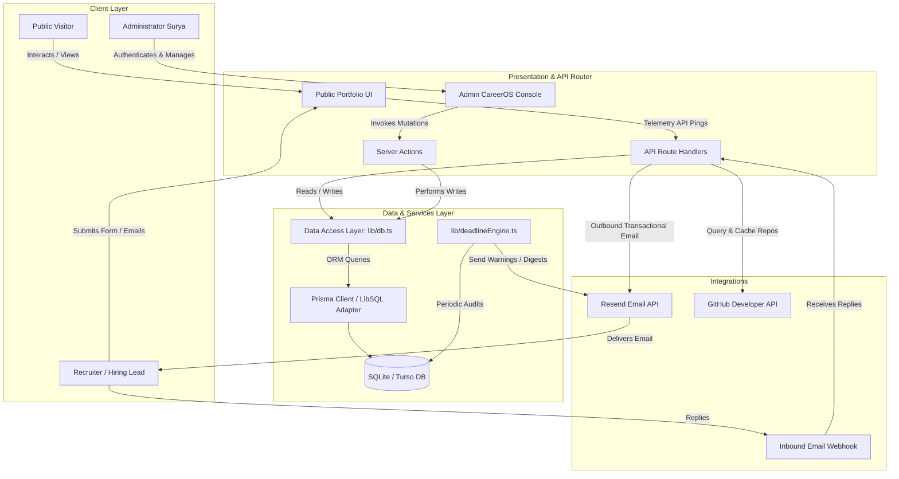
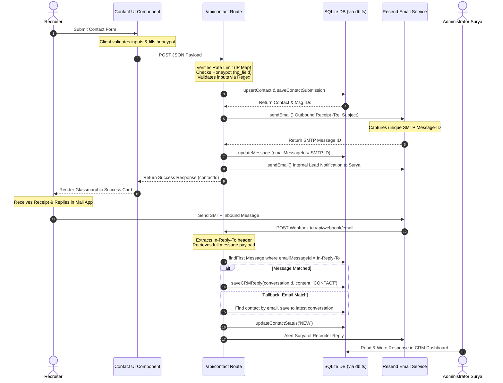
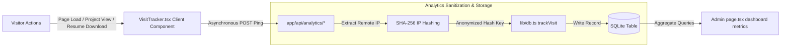
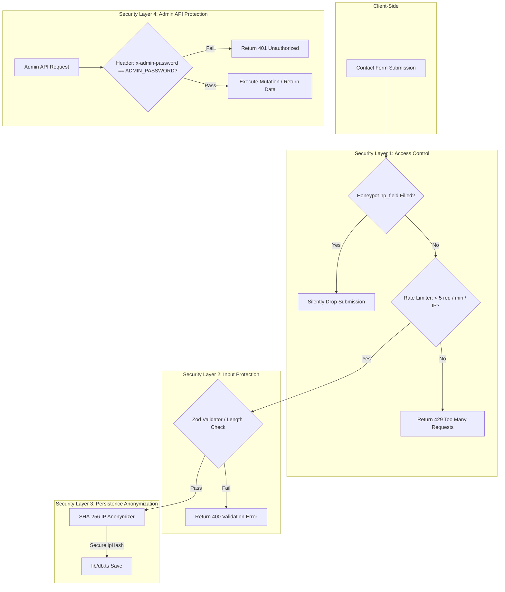

# CareerOS — Portfolio, Recruiter CRM & Career Management Platform

[](https://nextjs.org/)
[](https://react.dev/)
[](https://prisma.io/)
[](https://sqlite.org/)
[](https://resend.com/)

A production-grade, centralized career management platform designed to consolidate professional branding, recruiter relationship management, application pipelines, and real-time proactive tracking. This system combines an immersive client-facing WebGL portfolio with a secure, telemetry-driven administrator console, an integrated two-way email CRM, and an automated background deadline auditing daemon.

---

## Why This Project Stands Out

| Area | Highlights |
| :--- | :--- |
| **Product Thinking** | Combines developer presence with a recruiter lead-capture funnel, transitioning cold recruiter contacts into threaded conversations and dynamic pipeline trackers. |
| **Full Stack Development** | Implemented in Next.js 16 (App Router) and React 19, utilizing Server Actions for mutating pipeline items and Serverless Route Handlers for inbound tracking APIs. |
| **Database Design** | Utilizes a relational SQLite/LibSQL database modeled in Prisma with 17 distinct entities tracking communications, telemetry, alerts, and career objectives. |
| **Email Systems** | Implements automated receipts and internal lead notices via Resend, backed by a webhook receiver parsing inbound reply headers (`In-Reply-To`) to thread conversations. |
| **Analytics** | Measures engagement (visits, resume downloads, project views) without violating privacy, using serverless SHA-256 IP hashing to track unique telemetry. |
| **CRM Features** | Handles recruiter communications with custom status states (`NEW`, `CONTACTED`, `REPLIED`, `NETWORKING`), follow-up triggers, logs, and email response rate metrics. |
| **Scalability** | Designed for serverless environments with database drivers (LibSQL client) separating database queries from route handlers, supporting multi-region deployment. |
| **Security** | Implements honeypots, in-memory IP rate-limiters, input sanitization via Zod validation schemas, and authorized header-based single-user admin sessions. |

---

## System Overview

### System Integration Topology

The following architecture diagram displays the relationship between public visitors, recruiters, background automation, and the private administrator console:



---

## Architectural Deep Dive

### Frontend Architecture
The frontend is built on the **Next.js 16 App Router** paradigm, taking advantage of **React 19 Concurrent Features**. The page structure splits concerns between server-rendered static sections and client-rendered interactive modules to optimize initial paint and bundle sizes:
* **Server Components**: Used for static document layouts, footer structures, and initial data structures.
* **Client Boundaries**: Enforced at interactive boundaries, such as the Three.js WebGL canvas, Lenis smooth scrolling configuration, and the GSAP animation wrappers.
* **State Management**: Orchestrated via React Query (`@tanstack/react-query`) within the admin panel to provide state caching, stale-while-revalidate fetching, and optimistic UI updates.
* **Kinetic Design System**: A dark-themed layout built with CSS Variables and Tailwind CSS v4. Kinetic motion is powered by **GSAP (GreenSock)** and **Framer Motion**, which choreograph scroll-triggered entry sequences and structural reveals.

### Backend Architecture
The backend is structured to separate concern between API route endpoints and data models:
* **API Layer**: Utilizes Next.js Serverless Route Handlers (`app/api/*`) for data ingestion (e.g. analytics tracking and inbound email webhook endpoints).
* **Business Logic Layer**: Driven by Next.js Server Actions (`app/actions/careeros.ts`) for administrator state mutations (e.g. managing job applications, roadmaps, and scheduling follow-ups).
* **Data Access Layer (DAL)**: All queries to the SQLite/LibSQL database are consolidated inside [db.ts](file:///c:/projects/SGK18_Portfolio/lib/db.ts). This decouples HTTP/JSON serialization from ORM functions.
* **Prisma Engine**: The Prisma client ([prisma.ts](file:///c:/projects/SGK18_Portfolio/lib/prisma.ts)) utilizes the `@prisma/adapter-libsql` adapter. This configures the project to use a local file database during development while supporting an edge-replicated database like Turso in production with zero code changes.

### Data Flow Architectures

#### Contact Form Submission & Two-Way Threading Pipeline
The submission process is structured as an asynchronous event loop that logs metadata, schedules confirmations, and establishes thread headers:



#### Telemetry Analytics Processing Pipeline
Site visits, project views, and resume downloads are captured via a lightweight telemetry network:



---

## Database Design

The relational SQLite database schema is modeled to track communications, pipeline items, telemetry events, roadmaps, and automated system reminders.

### Entity Relationship Diagram

```mermaid
erDiagram
    CONTACTS ||--o{ CONVERSATIONS : "has"
    CONVERSATIONS ||--o{ MESSAGES : "contains"
    CONTACTS ||--o{ REMINDERS : "notifies"
    HACKATHONS ||--o{ REMINDERS : "schedules"
    APPLICATIONS ||--o{ REMINDERS : "schedules"
    GOALS ||--o{ REMINDERS : "schedules"

    CONTACTS {
        String id PK
        String name
        String email UK
        String company
        String role
        String linkedin
        String status "NEW | CONTACTED | REPLIED | NETWORKING | CLOSED"
        String source "PORTAL | INBOUND_EMAIL"
        String notes
        DateTime lastContact
        DateTime nextFollowUp
        DateTime createdAt
        DateTime updatedAt
    }

    CONVERSATIONS {
        String id PK
        String contactId FK
        String subject
        DateTime lastMessageAt
        DateTime createdAt
        DateTime updatedAt
    }

    MESSAGES {
        String id PK
        String conversationId FK
        String senderType "CONTACT | SURYA"
        String content
        String emailMessageId UK
        DateTime createdAt
    }

    ACTIVITY_LOGS {
        String id PK
        String action
        String metadata "JSON_String"
        DateTime createdAt
    }

    VISITS {
        String id PK
        String page
        String referrer
        String ipHash
        DateTime createdAt
    }

    RESUME_DOWNLOADS {
        String id PK
        DateTime createdAt
    }

    PROJECT_VIEWS {
        String id PK
        String projectId
        DateTime createdAt
    }

    OPPORTUNITIES {
        String id PK
        String title
        String company
        String type "INTERNSHIP | JOB | FREELANCE | OPEN_SOURCE | STARTUP"
        String status "DISCOVERED | RESEARCHING | APPLIED | INTERVIEW | OFFER | REJECTED | EXPIRED"
        String source
        String priority "HIGH | MEDIUM | LOW"
        String notes
        DateTime deadline
        DateTime createdAt
        DateTime updatedAt
    }

    HACKATHONS {
        String id PK
        String name
        String organizer
        String website
        DateTime deadline
        DateTime eventDate
        String status "RESEARCHING | PLANNING | REGISTERED | SUBMITTED | COMPLETED | WON | EXPIRED"
        String prize
        String teamMembers
        String notes
        DateTime createdAt
        DateTime updatedAt
    }

    APPLICATIONS {
        String id PK
        String company
        String role
        String location
        DateTime appliedDate
        DateTime nextFollowUp
        String status "SAVED | APPLIED | OA | INTERVIEW | FINAL_ROUND | OFFER | REJECTED | EXPIRED"
        String notes
        DateTime createdAt
        DateTime updatedAt
    }

    EVENTS {
        String id PK
        String title
        String category "HACKATHON | MEETUP | CONFERENCE | WORKSHOP | COLLEGE_EVENT"
        String location
        DateTime startDate
        DateTime endDate
        String registrationLink
        String notes
        DateTime createdAt
        DateTime updatedAt
    }

    LEARNING_ROADMAPS {
        String id PK
        String topic
        String category
        Int progress "0-100"
        DateTime targetDate
        String resources
        String notes
        DateTime createdAt
        DateTime updatedAt
    }

    GOALS {
        String id PK
        String title
        String description
        String category "ANNUAL | QUARTERLY | MONTHLY | WEEKLY"
        String status "NOT_STARTED | ACTIVE | COMPLETED | ARCHIVED | EXPIRED"
        Int progress "0-100"
        DateTime targetDate
        DateTime createdAt
        DateTime updatedAt
    }

    NOTES {
        String id PK
        String title
        String content
        String tags
        DateTime createdAt
        DateTime updatedAt
    }

    REMINDERS {
        String id PK
        String title
        String message
        DateTime reminderDate
        String type "EMAIL | DASHBOARD | BOTH"
        Boolean completed
        String targetType "HACKATHON | APPLICATION | CONTACT | GOAL"
        String targetId
        DateTime createdAt
        DateTime updatedAt
    }

    NOTIFICATION_LOGS {
        String id PK
        String entityType
        String entityId
        String notificationType "DEADLINE_1_DAY | DAILY_DIGEST_YYYY-MM-DD"
        DateTime sentAt
        String recipient
        String status "SENT | FAILED"
    }

    DASHBOARD_ALERTS {
        String id PK
        String title
        String message
        String urgency "CRITICAL | HIGH | MEDIUM | LOW"
        String relatedType
        String relatedId
        Boolean read
        Boolean dismissed
        DateTime createdAt
    }
```



### Table Specifications & Design Rationale
* **`contacts`**: Stores master recruiter metadata. Keyed by a unique index on `email` to allow upserting duplicate inquiries into the same conversation thread instead of generating redundant contacts.
* **`conversations` & `messages`**: Models threaded communication. The `Message.emailMessageId` stores the Resend SMTP message ID, enabling header-based linking when replies come in via webhook.
* **`reminders`**: Dynamically created by entity status triggers to schedule emails. Uncompleted items are indexed on `reminderDate` and `completed` for high-speed scanning by the background daemon.
* **`notification_logs`**: Prevents email duplication by maintaining a unique composite key index on `[entityType, entityId, notificationType]`. Even if the cron job triggers multiple times within a scanning window, a notification is dispatched only once.
* **`dashboard_alerts`**: Powers the real-time notification panel. Categorized by urgency (`CRITICAL`, `HIGH`, `MEDIUM`, `LOW`) and dismissed states to filter panel outputs.

---

## Subsystem Deep Dives

### 1. Recruiter CRM & Threading Engine
The CRM transforms contact form submissions into unified, conversational emails:
* **Two-Way Threading**: When Surya responds to a recruiter via the CRM Admin interface, the response is delivered to the recruiter's inbox with the original email header headers. When the recruiter replies, Resend's inbound webhook maps the reply using the `In-Reply-To` SMTP header. It resolves the original sender and conversation, inserts the message, and triggers an in-dashboard alert for Surya.
* **Metrics Aggregator**: The backend automatically tracks contact funnels, response rates (percentage of threads replied to), and average response times (calculating duration between the first contact and first reply) to ensure immediate lead conversion.

### 2. Proactive Deadline Intelligence & Reminder Engine
An automated service ([deadlineEngine.ts](file:///c:/projects/SGK18_Portfolio/lib/deadlineEngine.ts)) runs periodic audits on active deadlines:
* **Dynamic Reminders**: Sync engines delete existing pending reminders and recreate scheduling arrays whenever items (Hackathons, Goals, or Contact follow-ups) are created or updated.
* **Expiry Rules**: If an item passes its deadline without completion, the engine automatically updates its status to `EXPIRED` or `ARCHIVED`, logs the timeline change in `activity_logs`, and inserts a `CRITICAL` urgency dashboard alert.
* **Local Timezone Digests**: Daily Brief and Evening Summary emails are aligned with Surya's local timezone (UTC+05:30 IST) by computing relative offsets at execution time, delivering notifications exactly at 8:00 AM and 8:00 PM IST.

### 3. Privacy-Preserving Telemetry Analytics
To respect user privacy while capturing engagement, the system tracks metrics without cookies:
* **Unique Identification**: Client components fetch the visitor's remote IP and pass it to Route Handlers. The IP is combined with salt and hashed via **SHA-256** to generate an anonymous `ipHash`. 
* **Granular Tracking**: Telemetry records distinct pages viewed (`visits`), resume downloads (`resume_downloads`), and specific project cards clicked (`project_views`).

### 4. GitHub Caching Engine
The GitHub panel displays live statistics without hitting API rate limits:
* **In-Memory Cache**: Features a custom in-memory caching system with a 30-minute TTL.
* **Rate-Limit Mitigation**: If the GitHub API returns an error or rate limit, the API route falls back to stale cache values, ensuring zero downtime for visitors.
* **Language Aggregation**: Gathers language byte details across the top 20 repositories to calculate overall technology percentages.

---

## Key Engineering Decisions

### Why Prisma ORM over Raw SQL
* **Alternatives Evaluated**: Drizzle ORM, Raw Knex.js.
* **Trade-off**: Drizzle is lighter, but Prisma provides automatic database clients, declarative schema migrations, and structured relationships.
* **Benefit**: The type-safe Prisma client prevents SQL errors during build time, which keeps our database calls safe across CRM and CareerOS objects.

### Why SQLite with LibSQL Adapter over PostgreSQL (Initial Phase)
* **Alternatives Evaluated**: PostgreSQL (Neon), MySQL (PlanetScale).
* **Trade-off**: PostgreSQL handles write loads better, but local SQLite (`dev.db`) provides simple local setup and rapid local unit-test execution.
* **Benefit**: Using the LibSQL adapter allows the system to run on local SQLite during development, while easily upgrading to Turso distributed database at the edge for production.

### Why Next.js 16 Server Actions over REST APIs for Dashboard Mutations
* **Alternatives Evaluated**: Express API Gateway, Next.js Route Handlers.
* **Trade-off**: Route handlers are easier to test with outside tools, but Server Actions eliminate boilerplate, validate inputs with Zod schemas, and trigger instant `useQuery` cache updates.
* **Benefit**: Simplifies mutations inside the `CareerOSAdmin` console.

### Why Resend over SendGrid or Amazon SES
* **Alternatives Evaluated**: SendGrid, AWS SES.
* **Trade-off**: AWS SES is cheaper, but Resend has modern developer tools, out-of-the-box inbound webhook threading, and clean HTML layout handling.
* **Benefit**: Fast setup for recruiter response logs and Daily Brief email digests.

---

## Security Audit

The platform is designed to defend against automated spam, database poisoning, and unauthorized dashboard access:



### Defense Mechanisms
* **Honeypot Spam Protection**: The public form includes a hidden field (`hp_field`) that is invisible to users but filled out by automated bots. If this field contains any data, the server drops the request.
* **IP-Based Rate Limiting**: An in-memory rate-limiting table checks visitor IP hashes. Requests are restricted to a maximum of 5 submissions per minute per IP, preventing form spam.
* **Sessionless Admin Authentication**: The administrator console uses a secure password verified by the `verifyPasswordAction` server action. Subsequent requests use password checks in headers, avoiding session database queries.
* **Input Validation Schemas**: All inputs are checked using length limits (e.g. max 5,000 characters on message fields) and format rules to prevent injection attempts.

---

## Performance Optimization

The application achieves fast load times and smooth rendering through several frontend and backend optimizations:
* **Query Pre-Aggregation**: Instead of performing complex SQL joins for visitor referrers and views, [db.ts](file:///c:/projects/SGK18_Portfolio/lib/db.ts) aggregates data in memory during runtime, minimizing SQLite read-write loops.
* **Three.js Animation Tuning**: The 3D hyperspeed background ([Hyperspeed.tsx](file:///c:/projects/SGK18_Portfolio/components/Hyperspeed.tsx)) is initialized lazily and runs in a lightweight WebGL canvas using requestAnimationFrame loops, reducing CPU usage.
* **Lenis Smooth Scroll Integration**: Scroll events are decoupled from main thread layout calculations, ensuring fluid rendering during GSAP timeline triggers.
* **Static Rendering**: Landing page sections (About, Experience, Skills) are pre-rendered at build time, keeping initial loads fast.

---

## Scalability Roadmap

As traffic grows, the platform's architecture can scale from a single user to over 10,000 users:

### Phase 1: Growth to 100 Active Users
* **Database**: Migrate from local file SQLite to a remote **Turso LibSQL Database** using edge replication.
* **Telemetry**: Use a CDN layer (Cloudflare) to cache static assets and run initial rate limiting at the edge.
* **Session Security**: Replace header-based password validation with cookie-based JWT sessions (using NextAuth.js/Auth.js).

### Phase 2: Growth to 1,000 Active Users
* **Database**: Migrate to **PostgreSQL (Neon)** to support concurrent writes and transaction isolation. Add indexing on `messages(conversationId)` and `reminders(reminderDate, completed)`.
* **Caching**: Integrate **Redis (Upstash)** for rate-limiting and analytics tracking, offloading write checks from the primary database.
* **Task Queues**: Move the deadline engine and email digests from serverless cron routes to an event scheduler (such as QStash) to handle high-volume runs.

### Phase 3: Growth to 10,000+ Active Users
* **Write Consolidation**: Move analytics traffic to a dedicated timeseries engine (such as ClickHouse or a PostgreSQL TimescaleDB extension).
* **Message Brokering**: Use a message queue (BullMQ or RabbitMQ) to process transactional emails and webhook reply parsing, preventing background execution bottlenecks.
* **Read Replicas**: Deploy read-replicas for the PostgreSQL database, directing analytics queries to replicas while writes go to the primary database.

---

## Project Metrics

* **UI Components**: 19 components (`components/`)
* **API Endpoints**: 12 route handlers (`app/api/`)
* **Database Models**: 17 Prisma models
* **Deadline Warnings Triggers**: 43 active warning windows

---

## Folder Structure

```
c:\projects\SGK18_Portfolio\
├── app/                        # Next.js Application Core
│   ├── actions/                # Next.js Server Actions
│   │   └── careeros.ts         # CareerOS dashboard mutations & database triggers
│   ├── admin/                  # Protected CareerOS Console UI
│   │   ├── crm/                # CRM redirect routing
│   │   └── page.tsx            # Main tabbed workspace manager
│   ├── api/                    # API Route Handlers
│   │   ├── admin/              # Secured admin endpoints (CRM, stats)
│   │   ├── analytics/          # Telemetry trackers (visit, project, download)
│   │   ├── contact/            # Visitor submission endpoint (spam & verification)
│   │   ├── cron/               # Proactive deadline background scheduler
│   │   ├── github/             # Caching GitHub stats analyzer
│   │   ├── send/               # Transactional email helper
│   │   └── webhook/            # Inbound mail threading webhook
│   ├── globals.css             # Tailwind v4 styles & CSS Variables
│   ├── layout.tsx              # Root HTML wrapper
│   └── page.tsx                # Main developer portfolio page
├── components/                 # Reusable UI components
│   ├── Contact.tsx             # Client contact form with validation
│   ├── GitHubStats.tsx         # GitHub analyzer dashboard widget
│   ├── Hyperspeed.tsx          # Three.js 3D WebGL background
│   └── ...                     # Other sections (Hero, Projects, Navbar, etc.)
├── data/                       # Static JSON assets
│   └── caseStudies.ts          # Project data schema details
├── lib/                        # Common Utilities & Services
│   ├── db.ts                   # Unified Data Access Layer (DAL)
│   ├── deadlineEngine.ts       # Proactive deadline intelligence service
│   ├── prisma.ts               # Prisma connection singleton
│   └── smoothScroll.ts         # Lenis configuration utilities
├── prisma/                     # Database Schema & Migrations
│   └── schema.prisma           # Prisma relational models
├── public/                     # Static files (Resume, Images)
└── vercel.json                 # Vercel deployment configurations
```

---

## Developer Onboarding & Runbook

### Prerequisites
* **Node.js**: Version 20.x or higher
* **npm**: Version 10.x or higher

### Local Installation
1. Clone the repository:
   ```bash
   git clone https://github.com/sgk18/SGK18_Portfolio.git
   cd SGK18_Portfolio
   ```
2. Install dependencies:
   ```bash
   npm install
   ```
3. Configure the local environment file: Create a `.env.local` file in the root directory and configure the following:
   ```env
   ADMIN_PASSWORD=your_dashboard_access_password
   RESEND_API_KEY=re_your_resend_api_token
   RESEND_FROM_EMAIL=CareerOS <onboarding@resend.dev>
   RESEND_INBOUND_EMAIL=your_inbound_email@gmail.com
   CRON_SECRET=your_background_scheduler_cron_passkey
   WEBHOOK_SECRET=your_resend_inbound_webhook_token
   ```

### Database Initialization
Apply the Prisma models to the local database file:
```bash
npx prisma generate
npx prisma db push
```

### Running Locally
Start the Next.js development server:
```bash
npm run dev
```
Open [http://localhost:3000](http://localhost:3000) to view the public portfolio site. Access the admin console at `/admin`.

### Verification Tasks
* **Verify Typings**: Run `npx tsc --noEmit` to verify type safety.
* **Build Project**: Run `npm run build` to verify webpack bundling and compile errors.

### Deployment Guide
1. Import the repository into **Vercel**.
2. Add all environment variables in the Vercel project settings.
3. Switch from local SQLite to a remote **Turso DB**:
   * Create a database on Turso.
   * Add `TURSO_DATABASE_URL` and `TURSO_DATABASE_TOKEN` to your environment variables.
   * The database client ([prisma.ts](file:///c:/projects/SGK18_Portfolio/lib/prisma.ts)) will automatically use the Turso remote instance instead of `dev.db`.

---

## Future Roadmap

* **AI Resume Parser**: Automatically screen and match recruiter job descriptions against career goals.
* **Calendar Integration**: Synchronize application follow-up reminders with external calendar systems (Google Calendar/Outlook).
* **LinkedIn Data Sync**: Automatically sync recruiter profiles and messages with LinkedIn contacts.
* **Resume Version Tracking**: Analyze click-through rates and downloads for different resume versions.
