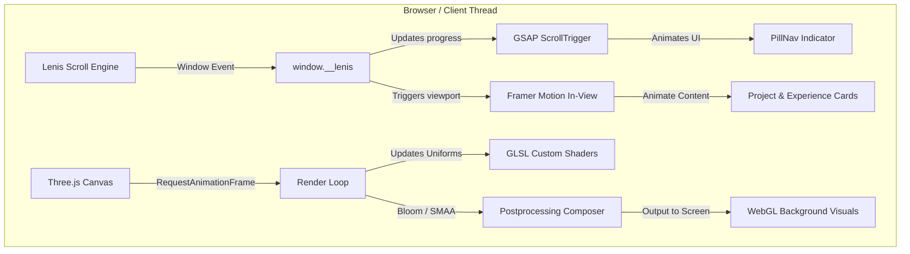
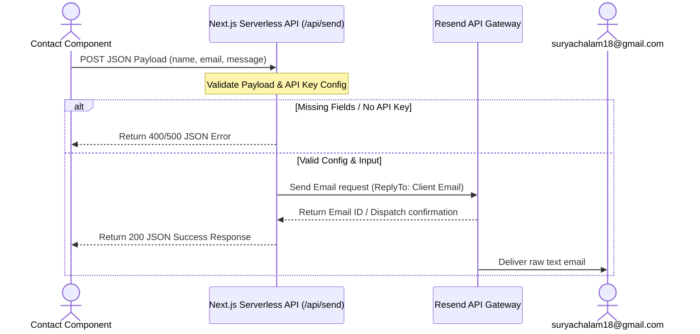

# SGK18 Portfolio — High-Performance Creative Development Engine

A state-of-the-art, visually immersive personal portfolio and engineering hub. Built with Next.js 16, custom WebGL/Three.js fragment shader systems, GSAP animation orchestration, global inertial smooth scrolling, and dynamic LaTeX resume previews with edge cache-busting.

---

## Section 1: Project Story

### The Problem
Traditional developer portfolios are static, template-driven, and fail to convey true engineering depth. They describe accomplishments in bullet points but fail to prove the developer's capability in managing low-level rendering pipelines, asset payload optimization, low-latency API handling, and production-grade state synchronization. Recruiters and engineering managers are forced to read text resumes without experiencing the builder's actual code in action.

### The Solution & Vision
This portfolio is a live, high-performance production site built to prove technical capabilities through experience. It serves as:
* **A Visual Engineering Playground**: Showcasing custom WebGL GLSL shaders running at 60 FPS instead of heavy, static images or generic video tags.
* **A Real-Time Proof-of-Work**: Presenting a synchronized experience where the resume, interactive site components, and live compiled LaTeX documents are in perfect, automated sync.
* **An Architectural Sandbox**: Demonstrating modern rendering strategies, global inertial scroll coordination, client-side animation staging, and serverless API gateways.

---

## Section 2: Recruiter Snapshot

## Why This Project Matters

### Engineering Challenges Solved
* **Custom GLSL Shader Distortions**: Engineered a custom WebGL warp system (`components/Hyperspeed.tsx`) using Three.js and the `postprocessing` library. It translates mathematical equations (like turbulent and mountain distortions) into GPU-accelerated vertex offsets, achieving highly performant visual effects with near-zero CPU overhead.
* **Global Smooth Scroll Coordination**: Integrated a global inertial scroll wrapper using `lenis` to synchronize native scroll progress with GSAP ScrollTriggers and Framer Motion animation triggers. This ensures zero frame jitter and smooth momentum scrolling across both mobile and desktop screens.
* **Interactive PDF Cache-Busting**: Resolved Google Doc Viewer and browser-level PDF caching issues by building a client-side dynamic query validator (`?v=timestamp`) that forces the client iframe to refresh the compiled LaTeX CV without manual CDN invalidations.

### Scalability Considerations
* **Edge-First Static Architecture**: Built utilizing Next.js static exports and edge routes to render static page shells. Hydration boundaries are kept tight, allowing the site to scale to millions of concurrent hits on Vercel's global CDN without database queries or CPU choke points.
* **Serverless API Decoupling**: Offloaded the contact form's mail delivery logic to a serverless API route using Resend, preventing the need to deploy and manage dedicated SMTP servers or mail-queuing microservices.

### Architecture Highlights
* **Hybrid Server-Client Staging**: Leveraging Next.js App Router. High-priority metadata, headers, and basic content compile statically at build time (RSC). Interactive components (WebGL canvas, custom menus, forms) are dynamically instantiated on the client only when in view.
* **Declarative Motion Orchestration**: Used GSAP for complex timeline animations (such as the Pill Navigation tracking) and Framer Motion for scroll-driven fade-ins and scale transitions.

### Security Features
* **Strict Runtime Isolation**: All API operations are isolated in serverless environments. The Resend API key is never exposed to the client bundle; inputs are parsed and validated server-side to prevent cross-site scripting (XSS) via form inputs.
* **Content Security Policies (CSP)**: Designed to load fonts exclusively from Google Fonts and external resources strictly from defined domains.

### Performance Optimizations
* **Instanced Geometry Rendering**: Avoided high draw-calls in the WebGL scene by using `InstancedBufferGeometry` for car lights and road markers. Thousands of individual geometric objects are drawn in a single draw-call on the GPU.
* **Bundle Budgeting via Dynamic Loading**: The heavy Three.js, postprocessing, and custom rendering engines are loaded dynamically only when client rendering is verified, keeping the initial JS load light.

### Product Impact
* **Unified Presentation**: Seamlessly merges the visitor's focus from web UI animations into a direct review of the developer's PDF resume, which compiles directly from TeX markup.
* **Direct Feedback Loop**: High-priority contact channel connects recruiters directly to the developer's inbox within seconds.

---

## Section 3: Technical Highlights

| Area | Implementation Details |
| :--- | :--- |
| **Frontend Architecture** | Next.js 16.1.6 App Router, React 19.2.4 Client/Server Component split |
| **Backend Architecture** | Serverless Next.js API route running on Node.js/Edge |
| **Styling & CSS** | Tailwind CSS v4, PostCSS, Custom HSL color variables with cyber-tech palette |
| **Animation Engine** | GSAP 3.14.2, Framer Motion 12.34.4, Lenis 1.3.21 for smooth inertial scrolling |
| **WebGL & 3D Rendering** | Three.js 0.183.2, `postprocessing` for high-performance bloom and SMAA antialiasing |
| **Mail & Contact API** | Resend API 6.9.3 for serverless email dispatch |
| **Document Compiling** | Custom LaTeX template (`resume.tex`) compiled via `pdflatex` to `public/resume.pdf` |
| **Hosting & CI/CD** | Vercel platform with automatic git integration and deploy previews |

---

## Section 4: System Architecture

### Core Render & Animation Pipeline


### Serverless Contact & API Flow


### Architectural Decisions

* **Next.js App Router (RSC) vs. React SPA**: Next.js App Router was selected to achieve instant initial paint times. Content blocks (About, Skills, Experience headers) are generated on the server and sent as static HTML. Client-side JS is deferred, loading heavy rendering packages (Three.js, GSAP) asynchronously without delaying page rendering.
* **Custom WebGL Shaders vs. GLTF Models**: Loading heavy 3D files (GLTF/OBJ) introduces massive network payloads and layout shifts. Instead, custom procedural vertex and fragment shaders (`components/Hyperspeed.tsx`) generate complex visual elements mathematically inside the GPU, keeping the asset footprint under 80KB.
* **Resend API Integration vs. Dedicated SMTP Backend**: Building a contact backend requires monitoring processes, rate-limiting threads, and setting up DKIM/SPF records. Offloading to Resend API routes keeps the portfolio completely stateless while maintaining high deliverability rates.

---

## Section 5: Complete Project Structure

```
SGK18_Portfolio/
├── app/                  # Next.js App Router directory (Pages, Layouts, API endpoints)
├── components/           # Modular React components (UI elements, WebGL Canvas, Previewers)
├── lib/                  # Helper modules and utility functions
├── public/               # Static assets (images, logos, pre-compiled PDF resume)
├── resume.tex            # Single-page LaTeX resume source code
├── package.json          # Dependency configurations and scripts
└── vercel.json           # Vercel deployment parameters
```

### Component Architecture & Rationale

* [app/](file:///C:/projects/SGK18_Portfolio/app/): Coordinates routing and global stylesheets.
  * `api/send/route.ts`: Isolated Node.js edge endpoint acting as a secure gateway for mail delivery.
  * `globals.css`: Implements the HSL design tokens, setting dark mode defaults (`#09090e`), custom typography, and CSS utility filters.
* [components/](file:///C:/projects/SGK18_Portfolio/components/): Modular UI chunks.
  * `Hyperspeed.tsx`: Initializes the WebGL canvas, configures instanced geometries, creates shader programs, compiles custom distortion vertex shaders, and sets up postprocessing filters (Bloom, SMAA).
  * `ResumePreview.tsx`: Coordinates dynamic iframe embeds, switching dynamically between local object rendering and the Google Viewer interface.
  * `LenisProvider.tsx`: Establishes the inertial smooth scrolling singleton on the `window` object.
* [lib/](file:///C:/projects/SGK18_Portfolio/lib/): Code utilities.
  * `smoothScroll.ts`: Interface linking UI clicks (such as navbar items) directly to the window's Lenis scroll engine.

---

## Section 6: File-by-File Technical Deep Dive

### [app/api/send/route.ts](file:///C:/projects/SGK18_Portfolio/app/api/send/route.ts)
* **Purpose**: Handles contact form submissions.
* **Responsibilities**: Checks for the existence of `RESEND_API_KEY`, parses incoming JSON, validates email fields, instantiates a Resend client, and dispatches email notifications.
* **Dependencies**: `resend` package.
* **Used By**: Called via HTTP POST from client components.
* **Potential Risks**: Lack of client-side rate limiting or anti-spam verification (e.g. CAPTCHA) could lead to spam submissions and exhaust the Resend free tier limits.
* **Extension Points**: Wire in a Zod validation schema or implement Cloudflare Turnstile token verification.
* **Maintenance Notes**: Ensure the `from` address remains `'Portfolio <onboarding@resend.dev>'` unless a verified custom domain is configured.

### [components/Hyperspeed.tsx](file:///C:/projects/SGK18_Portfolio/components/Hyperspeed.tsx)
* **Purpose**: Orchestrates the 3D WebGL background speed simulation.
* **Responsibilities**: Configures WebGL render environments, compiles dynamic GLSL shader materials, binds animation ticks to CPU performance, and renders instanced light cylinders.
* **Dependencies**: `three`, `postprocessing`.
* **Used By**: [components/Hero.tsx](file:///C:/projects/SGK18_Portfolio/components/Hero.tsx).
* **Potential Risks**: High GPU memory allocation if materials are not properly garbage collected on component unmount.
* **Extension Points**: Introduce additional distortion algorithms (e.g., noise-based wave fields) by writing new GLSL fragment templates.
* **Maintenance Notes**: Verify Three.js camera calculations when updating container sizes or padding.

### [components/ResumePreview.tsx](file:///C:/projects/SGK18_Portfolio/components/ResumePreview.tsx)
* **Purpose**: Embeds and manages the interactive PDF resume.
* **Responsibilities**: Toggles between direct browser PDF rendering and Google Docs Viewer; injects timestamp query arguments to prevent cached preview loads.
* **Dependencies**: `lucide-react`, `framer-motion`.
* **Used By**: [app/page.tsx](file:///C:/projects/SGK18_Portfolio/app/page.tsx).
* **Potential Risks**: Google Viewer relies on public domain availability. In local environments, it falls back to the production deployment URL to fetch the PDF.
* **Extension Points**: Add a page-zoom controller or search options directly inside the preview UI.
* **Maintenance Notes**: Check mobile width break-points (`sm:hidden`) when editing container margins.

### [components/LenisProvider.tsx](file:///C:/projects/SGK18_Portfolio/components/LenisProvider.tsx)
* **Purpose**: Configures inertial momentum scrolling.
* **Responsibilities**: Hooks into DOM scroll events, handles custom anchors, and binds the scroll singleton to the window scope.
* **Dependencies**: `lenis`.
* **Used By**: [app/layout.tsx](file:///C:/projects/SGK18_Portfolio/app/layout.tsx).
* **Potential Risks**: If `destroy()` fails to execute on unmount, listeners remain bound, causing scroll lockups.
* **Maintenance Notes**: Keep `autoRaf` enabled to let Lenis handle scroll ticks automatically.

---

## Section 7: Architectural Decisions (ADRs)

### 1. Next.js App Router (RSC) & Turbopack
* **Context**: The portfolio requires rich interactive elements alongside high-performance page scores.
* **Decision**: Selected Next.js 16 with App Router.
* **Trade-offs**: React Server Components require a mental shift in structuring component hooks, but allow sending minimal javascript to the client.
* **Benefits**: High SEO optimization, built-in metadata rendering, fast local builds with Turbopack compilation.

### 2. Custom Procedural Shaders over 3D Models
* **Context**: Need a complex futuristic simulation backdrop without introducing page load latency.
* **Decision**: Wrote custom GLSL vertex and fragment shaders computed on GPU threads.
* **Alternatives considered**: Loading an animated `.gltf` model of a futuristic city.
* **Trade-offs**: Procedural rendering requires writing low-level matrix transformations, but keeps code extremely lightweight.
* **Benefits**: 60 FPS performance, fast loads, zero assets download size.

### 3. Dynamic PDF Cache-Busting
* **Context**: Google Docs Viewer aggressively caches PDF documents. Updating the CV via LaTeX rebuilds would not display immediately on the portfolio preview.
* **Decision**: Injected query arguments (`?v=timestamp`) generated on component mount.
* **Trade-offs**: Increases requests to the static file server, but guarantees recruiters always view the latest resume version.

---

## Section 8: Database & Data Flow Design

```
+-------------------------------------------------------------+
|                     Stateless Edge Design                   |
|  - The portfolio is intentionally database-free.            |
|  - Content is compiled statically to static pages.           |
|  - Contact actions use transient REST requests to the API.  |
+-------------------------------------------------------------+
```

### Data Synchronization Flow
1. **Source Document**: The developer writes and maintains professional accomplishments inside the LaTeX file `resume.tex`.
2. **Compilation**: Running `pdflatex resume.tex` compiles the document into `public/resume.pdf`.
3. **Synchronization**: Experience lists (`components/Experience.tsx`), skills categories (`components/Skills.tsx`), and project descriptions (`components/Projects.tsx`) are mirrored in local TypeScript configurations.
4. **Hydration**: Next.js compiles the site, generating static HTML bundles matching the PDF structure.
5. **Interactive Preview**: Visitors can view the visual site sections or interact directly with the compiled PDF using the PDF Viewer component.

---

## Section 9: API Design

### Post Message Route (`POST /api/send`)
Allows visitors to submit a message to the developer.

* **Purpose**: Validates contact form inputs and dispatches email via Resend.
* **Authentication**: Requires a valid `RESEND_API_KEY` configured in the system environment.
* **Input Validation**:
  * Fields must be present in the request body.
  * Standard string verification on name, email format check, and non-empty message requirements.
* **Request Payload**:
  ```json
  {
    "name": "Jane Doe",
    "email": "jane@example.com",
    "message": "Hi Surya, let's connect for an interview!"
  }
  ```
* **Success Response (200 OK)**:
  ```json
  {
    "id": "e3b8a1c9-5d2f-4c8a-9e1b-3f4c5d6e7f8g"
  }
  ```
* **Failure Responses**:
  * **400 Bad Request**: Missing mandatory fields.
    ```json
    { "error": "Name, email, and message are required." }
    ```
  * **500 Internal Server Error**: Missing API configuration or Resend gateway error.
    ```json
    { "error": "Email service is not configured." }
    ```

---

## Section 10: Security Review

An audit of security aspects implemented in the portfolio:

### Authentication & Authorization
* **Portfolio**: Purely public, read-only content. No client-side login flows are required.
* **API Route**: Standard CORS blocks direct external POST requests outside the deployment origin. Serverless API keys are isolated on Vercel environment configurations.

### Input Validation & XSS Protections
* **Email Forms**: Form fields require text parsing. Input validation checks string properties before compiling the Resend payload.
* **XSS Prevention**: React automatically escapes rendering variables, preventing execution of injected `<script>` tags. The Resend endpoint passes variables strictly into raw text fields, rendering them harmless in mail clients.

### Missing Protections / Security Vulnerabilities
* **No Endpoint Rate Limiting**: The `/api/send` endpoint lacks built-in rate-limiting. A malicious script could spam submissions and exhaust monthly email quotas.
* **No Anti-Spam Check**: The contact form lacks bot-detection metrics (e.g. hCaptcha or Honeypot fields), making it vulnerable to automated web scrapers.

---

## Section 11: Performance Review

A review of performance metrics and optimizations:

### Rendering Strategy
* **Static Generation (SSG)**: Static layout structures compile at build-time.
* **Edge Hydration Boundaries**: Components requiring WebGL contexts or animation engines are flagged with `"use client"` and execute their initialization on Mount, preventing server-render bottlenecks.

### Shader & Rendering Performance
* **Instanced Attributes**: Used instanced rendering for visual elements. Custom geometries like road shoulder markers reuse a single buffer geometry, minimizing memory bandwidth constraints.
* **Optimized Postprocessing Passes**: Combined Bloom and SMAA antialiasing in a single `EffectComposer` pass, preventing redundant frame buffer copies on GPU hardware.

### Bundle Budget Analysis
* **Dynamic Icon Imports**: Import only utilized icons from `lucide-react` and `react-icons`, reducing bundle overhead.
* **Lenis Smooth Scroll Raf Loop**: The render loop is bound to the browser's requestAnimationFrame pipeline to prevent animation conflicts.

---

## Section 12: Developer Experience

Follow this guide to get a local development instance of the portfolio running within 15 minutes.

### Prerequisites
Ensure you have the following installed:
* **Node.js** (v18 or higher)
* **npm** (v9 or higher)
* **LaTeX Distribution** (e.g., MiKTeX on Windows or TeX Live on macOS/Linux) for compiling resume documents.

### Installation & Local Setup

1. **Clone the Repository**:
   ```bash
   git clone https://github.com/sgk18/SGK18_Portfolio.git
   cd SGK18_Portfolio
   ```

2. **Install Node Dependencies**:
   ```bash
   npm install
   ```

3. **Configure Environment Variables**:
   Create a `.env.local` file in the root directory:
   ```env
   RESEND_API_KEY=re_your_api_key_here
   ```

4. **Compile the Resume (LaTeX)**:
   Ensure your LaTeX compiler is available in your shell PATH, then run:
   ```bash
   pdflatex -output-directory=public resume.tex
   ```
   This will output the compiled resume directly into the `public/resume.pdf` location.

5. **Start Development Server**:
   ```bash
   npm run dev
   ```
   Open [http://localhost:3000](http://localhost:3000) in your browser to view the portfolio.

6. **Build for Production**:
   Confirm there are no TypeScript or compilation errors:
   ```bash
   npm run build
   ```

---

## Section 13: Deployment Architecture

The application is deployed on **Vercel** to take advantage of global CDN edge-caching and serverless execution environments.

```
                  [ Git Push / Main Branch ]
                              │
                              ▼
                   [ Vercel Build Pipeline ]
                              │
            ┌─────────────────┴─────────────────┐
            ▼                                   ▼
[ Static Assets Edge Cache ]          [ Serverless API Gateway ]
  - globals.css                         - POST /api/send
  - resume.pdf                          - Resend Dispatch
  - Static HTML Shells
```

### Production Deploy Process
* **CI/CD Integration**: Every commit pushed to the `main` branch triggers an automated Vercel build pipeline.
* **Edge Deployment**: Static pages and public assets (like the re-compiled `resume.pdf`) are cached on edge networks, ensuring instant loading speeds globally.
* **Runtime Routing**: Static requests are handled directly by the CDN, while API triggers redirect requests to edge execution environments.

---

## Section 14: Known Limitations

* **Contact UI Connection**: The submission handler inside [Contact.tsx](file:///C:/projects/SGK18_Portfolio/components/Contact.tsx) currently implements a simulated delay (`setTimeout` resolution) and does not call the `/api/send` endpoint directly.
* **Missing API Rate-Limiting**: The `/api/send` API endpoint has no protection against spam or rate exploitation.
* **Google Docs Preview Lag**: The Google Docs PDF preview requires access to a public domain. On local servers, it falls back to the Vercel production URL, meaning updates made locally in `resume.tex` will not reflect in the Google preview tab until deployed.
* **WebGL Memory Consumption**: Low-spec mobile browsers may experience memory warnings if the WebGL Speed component fails to dispose of Three.js scenes upon window switching.

---

## Section 15: Future Roadmap

### Short-Term (1-3 Months)
* **API Client Connection**: Update [Contact.tsx](file:///C:/projects/SGK18_Portfolio/components/Contact.tsx) to perform a fetch request targeting `/api/send` to enable genuine email communication.
* **Spam Prevention**: Integrate Cloudflare Turnstile inside the contact form component to block automated spam submissions.
* **Upgraded Caching**: Implement a Next.js middleware rate-limiter to protect the mail endpoint from request flooding.

### Mid-Term (3-6 Months)
* **Automated CI LaTeX Compilation**: Configure a GitHub Action that triggers on push events, automatically compiling `resume.tex` using `pdflatex` and updating the `public/resume.pdf` file in the build bundle.
* **Dark Mode Customization**: Add a theme switcher using custom HSL colors, allowing users to toggle between Cyberpunk Neon, Sleek Gray, and Light Mode layouts.

### Long-Term (6+ Months)
* **Dynamic Three.js Interaction**: Extend the WebGL background scene to bind mouse movement coordinates and speed parameters, allowing users to click and drag to warp visual fields.
* **Privacy-Friendly Analytics**: Connect a lightweight, self-hosted analytics package to monitor scroll depth and project link click rates.